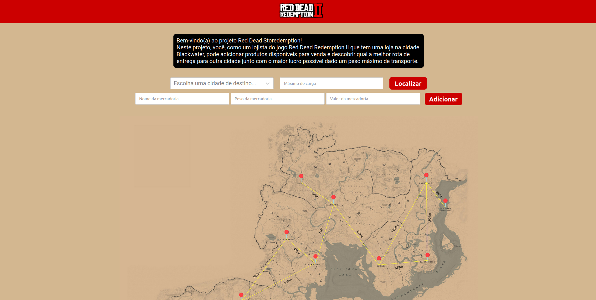
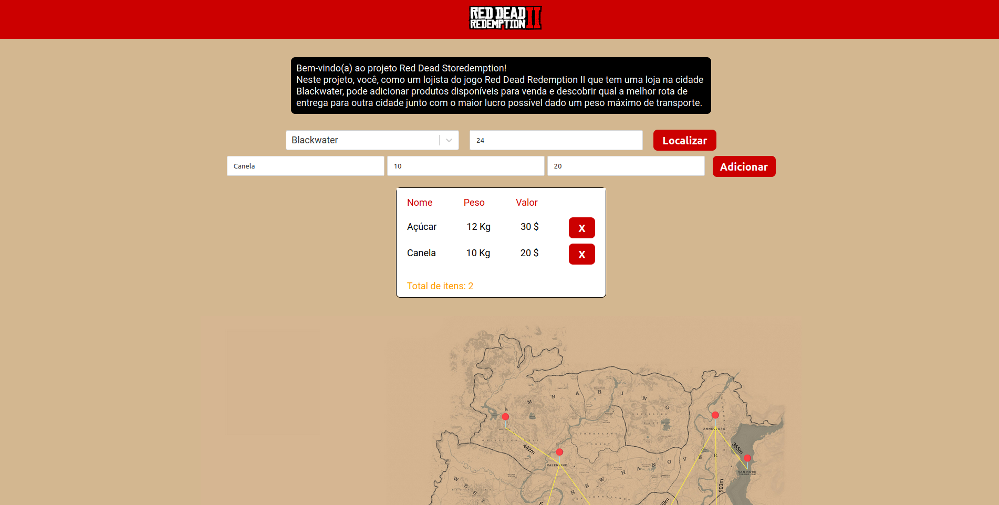
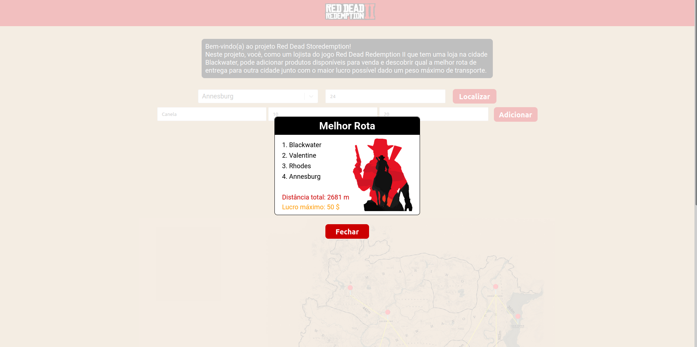

# Red Dead Storedemption


**Número da Lista**: X<br>
**Conteúdo da Disciplina**: Final<br>

## Alunos
|Matrícula | Aluno |
| -- | -- |
| 18/0106821  |  Mateus Gomes do Nascimento |
| 18/0132245  |  Vinicius de Sousa Saturnino |

## Sobre 

Um lojista do universo do jogo Red Dead Redemption II possui uma loja na cidade de Blackwater, e ele gostaria de otimizar suas entregas ao máximo, sabendo qual a melhor rota para efetuar uma entrega de produtos em uma certa cidade e qual o máximo de lucro ele poderia obter dado o peso e o valor dos produtos disponíveis, sabendo que o carroçaboy (motoboy da época dos cowboys) possui um limite de peso em sua carroça.

## Screenshots





## Instalação 
**Linguagem**: python (back-end) & javascript (front-end)<br>
**Framework**: flask & react js<br>

Um dos pré requisitos para rodar o projeto é ter o `docker` e o `docker-compose` instalados. Outro pré-requisito é ter o `python` versão 3+.

Para subir o docker basta rodar o camando na raíz do projeto:

```shell
$ docker-compose up --build
```

Uma segunda alternativa (caso não possua o `docker` e o `docker-compose` instalados ou não queira perder tempo instalando) é rodar o script `main.py` em `api.main.py` com o comando:

```shell
$ python3 api/main.py
```

para subir o frontend basta executar os comandos dentro da pasta frontend:

```shell
$ yarn
```
e

```shell
$ yarn start
```

E acessar o endereço `http://localhost:3000` no seu navegador.

## Uso 

A partir da interface web, adicione produtos disponíveis, atribuindo um nome, um peso e um valor para cada produto, juntamente com o peso máximo suportado e a cidade de destino. Com tudo preenchido, o botão "Localizar" irá mostrar a melhor rota para o destino juntamente com o lucro total máximo calculado a partir do peso e valor dos produtos.


